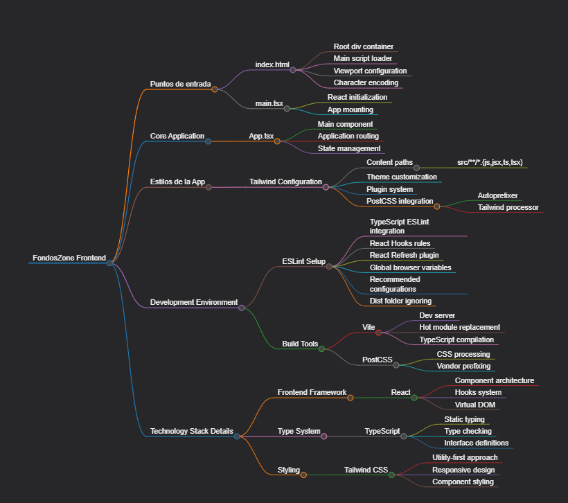

# React + TypeScript + Vite

APLICACION DE CRUD DE FONDOS DE INVERSION EN REACT

# FondosZone Frontend

### Puntos de entrada
- index.html
  - Root div container
  - Main script loader
  - Viewport configuration
  - Character encoding
- main.tsx
  - React initialization
  - App mounting

### Core Application
- App.tsx
  - Main component
  - Application routing
  - State management

### Estilos de la App
#### Tailwind Configuration
- Content paths
  - src/**/*.{js,jsx,ts,tsx}
- Theme customization
- Plugin system
- PostCSS integration
  - Autoprefixer
  - Tailwind processor

### Development Environment
#### ESLint Setup
- TypeScript ESLint integration
- React Hooks rules
- React Refresh plugin
- Global browser variables
- Recommended configurations
- Dist folder ignoring

#### Build Tools
- Vite
  - Dev server
  - Hot module replacement
  - TypeScript compilation
- PostCSS
  - CSS processing
  - Vendor prefixing

### Technology Stack Details
#### Frontend Framework
- React 
  - Component architecture
  - Hooks system
  - Virtual DOM

#### Type System
- TypeScript
  - Static typing
  - Type checking
  - Interface definitions

#### Styling
- Tailwind CSS
  - Utility-first approach
  - Responsive design
  - Component styling

  
